# GcproExtensionApp使用说明

| 版本 | 日期       | 作者                            | 检查 |
| ---- | ---------- | ------------------------------- | ---- |
| 1A   | 01.08.2024 | Hao Lei, Automation-PLC/MC-PCS5 |      |
|      | 第一版     |                                 |      |

[[_TOC_]]

## 1 功能概述

GcproExtensionApp是一个用于配合Gcpro提高组态效率的工具，通过工具快速生成Gcpro对象的文本文件，利用Gcpro标准工具`Import\Import Table(IO or Objects)`导入生成对象，该工具主要包含以下功能：

- 自定义规则生成Gcpro对象导入文件;
- 通过标准BML文件生成Gcpro对象导入文件;
- 基于Gcpro数据库中IO生成Gcpro对象导入文件;
- 关联对象的IO与连锁关系;

## 2 工具介绍

### 2.1 工具运行目录

GcproExtensionApp工具程序目录中的所有文件，缺一不可，禁止删除。

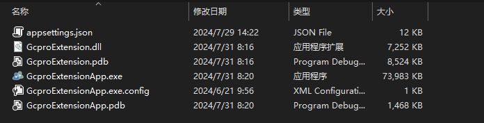

- appsettings.json 配置文件，在`appsettings.json配置文件`章节中详细介绍，后续涉及到该文件的描述，统一以`配置文件`代替。
- GcproExtension.dll 标准程序集文件。
- GcproExtensionApp.exe 工具可执行程序，双击可运行GcproExtensionApp。
  
### 2.2 开始使用工具

双击 GcproExtensionApp.exe 运行工具软件，首先出现如下主界面。

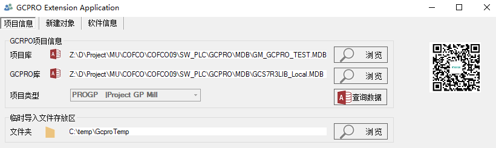

主界面包含三个不同的分界面：[项目信息]，[新建对象]，[软件信息]

#### 2.2.1 [项目信息]

##### 2.2.1.1 GCPRO项目信息

包含项目所使用的GCPRO库，项目库以及项目类型，，单击各自的`浏览`按钮或者双击`路径显示文本`，可以弹出文件浏览对话框，选择相应的项目数据库文件。

##### 2.2.1.2 临时文件存放区

临时存放工具所生成的对象文本文件夹，可以通过`浏览`按钮或者双击`路径显示文本`，可以弹出文件夹浏览对话框，默认路径为`C:\Temp`。
多数对象会生成3个文件：xxx.txt,xxx_Relation.txt以及xxx_FindConnector.Txt，部分对象只有xxx.Txt文件。 
其中xxx.txt,xxx_Relation.txt在新建对象时同时生成，它们分别是用于对象导入的文本文件和对象关系关联文件(**包含对象与IO关联关系，对象与子对象之间的关联关系以及对象之间的连锁关系**)。 
xxx_FindConnector.Txt文件为通过对象在数据库中寻找IO所形成的关系文件。比如(**建立电机时，没有IO表，当IO表导入GCPRO项目后，可以通过工具一次性生成电机与IO的关联关系文件，再通过GCPRO导入即可完成电机与IO的关联**)。 
后续会详细解释每个对象文本文件。 
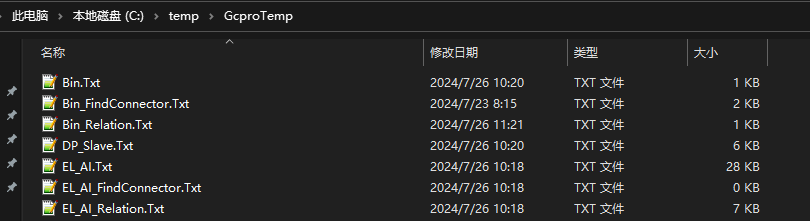

##### 2.2.1.3 查询数据

 通过查询数据功能，可以一次性地查看某种对象的某个字段信息以及更新特定条件下的对象某个字段的值。
 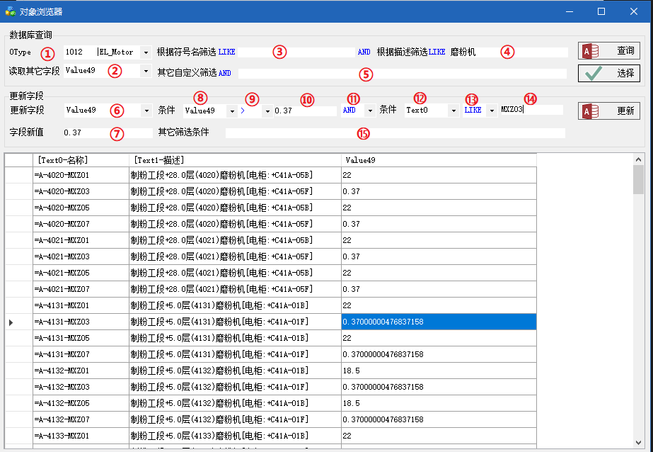

- 数据查询  
  ① 选择对象类型。 
  ② 读取除名称与描述外的另一个信息,可以通过GCPRO软件或者GcproExtensionApp软件查询信息存放在数据库哪个字段(将鼠标放入相关文本框中即可显示。比如电机的功率信息PowerNominal存放在数据库的Value49字段)。 
  ③④⑤ 数据库查询筛选，目前仅支持通过符号名，描述已经进行筛选，名称与符号名同时满足筛选条件的数据，才会显示在下面的数据表格中。其它自定义筛选，需要了解基本的数据库查询语句知识。当筛选文本为空时，默认不使用该筛选条件。 

- 更新字段
  更新字段操作的数据是在查询数据筛选出的数据的基础上进行的。 
  ⑥ 需要更新的字段。 
  ⑦ 在此处输入字段的新值。 
  ⑧⑨⑩⑪⑫⑬⑭⑮ 更新字段的额外筛选条件。 

- 上图查询数据与更新字段解释 
  首选，查询出`描述`中包含`磨粉机`的且类型为`EL_Motor`对象的三个字段信息`名称``描述``Value49`；
  在以上查询到的结果的基础上，进一步筛选，满足 `Value49 > 0.37`同时`Text0`包含`MXZ03`条件的基础上，更新字段`Value49`值，新值设为`0.37`。

#### 2.2.2 [新建对象]

支持快速建立以下对象，本章节将逐一详细介绍。

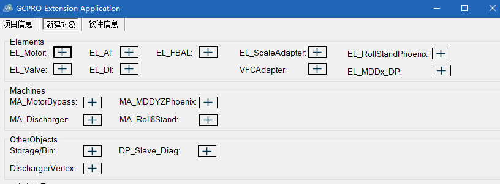

##### 2.2.2.1 通用描述

- 每种对象建立窗口包含[自定义规则]与[通过BML创建]2个页面(部分对象除外)，点击相应按钮可以切换页面。 
  
- [自定义规则]页面用于①用户自己根据一定的规则来快速创建对象；②根据IO搜寻来创建对象。 
  
- [通过BML创建]通过浏览BML文件中的信息来创建对象。 
  
  相对于[自定义规则]与[IO搜寻]，通过BML文件创建对象，对象参数更加合理；电柜，楼层，生产线等信息可以直接导入到GCPRO中；同时更加高效； 

###### 2.2.2.1.1 自定义规则页面
  
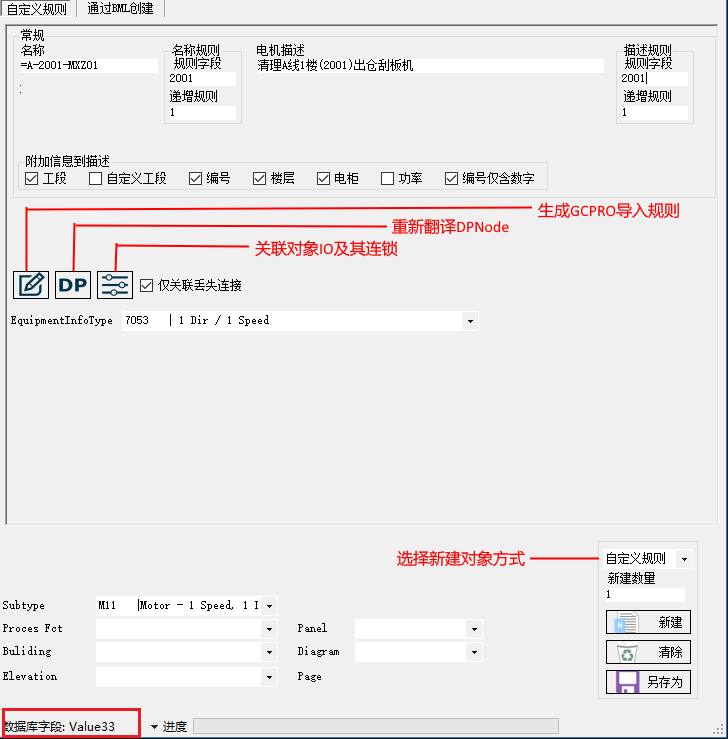
**名称与描述部分**

- 规则字段与递增规则部分必须是数字，否则，软件给出`请输入一个数字类型`消息框。 

- 当输入设备名称的时候，软件自动提取数字部分到`名称`的规则字段中，`名称`递增规则默认为1(**可以为负数**)。 

- 每次打开对象窗口后，名称与描述都会有一个默认值，比如电机默认名称为`=A-2001-MXZ01`,描述默认为`清理线A线1楼(2001)出仓刮板机`。 

- 以电机为例，如果需要在软件运行期间，再打开电机界面时，默认名称改为`=A-4001-MXZ01` ，那么只需要输入新的电机名称然后，按下**回车键**。 
  
- `描述`部分默认格式`xxx生产线xx楼层(xxxx设备编号)yyyyy设备描述`，当`描述`部分变化时，软件自动提取数字部分到`描述`的规则字段，当`描述`部分含有多个数字部分时，需要根据需求自己更改规则字段。 

- 以电机为例，如果需要在软件运行期间，再次打开电机界面后，默认描述改为"制粉A线2楼(4001)磨粉机"，那么需要在描述中以以下格式手动更改描述为"制粉A线,2楼,(4001),磨粉机" (要以'逗号'隔开每个信息段，如果逗号数量不足3个，那么系统默认第一个逗号前为生产线信息，第二个逗号前为楼层信息，以此类推，没有逗号，则默认没有任何附件信息)，完成后按下回车键，描述将自动去除逗号变回 "制粉A线2楼(4001)磨粉机"。

- 无论名称还是描述当`规则字段`为空或者`递增规则`位0时，**无论创建多少数量的相关对象，对象名称与描述保持不变；对于名称来说这是一个错误设置！**
  
**附加信息到描述**

- 可以把额外信息附加到描述上，比如工段、编号、楼层、电柜、功率等信息。
  
- 对于BML创建对象方式，工段信息可以根据对象名称反推出所在工段(**相关配置在appsettings.Json中介绍**)，也可以在BML表格中新加一列`自定义工段`，读取改列信息，附加到`描述`中；在创建对象过程中编号、楼层、电柜、功率信息会根据BML表格中信息动态改变
  
- 对于按照规则创建对象的方式，附加信息中除了编号信息会多态改变外，其余信息维持不变。

- 对于不需要附加到`描述`的信息，可以去掉相关的选择框。

**功能按钮**

- 创建GCPRO导入规则，单机此按钮，会在GCPRO项目数据库中新建相关对象的导入规则，规则名称统一前缀为`IE_`。导入成功后，可以通过GCPRO菜单`Import\Import Table(IO or Objects)`查看，后续导入相应对象要选择相应的规则，见下图所示。
  
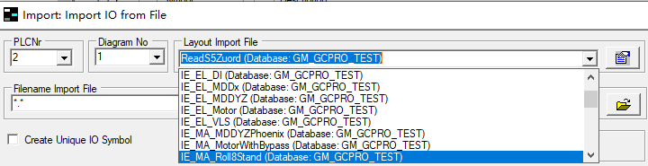

- 重新翻译DPNode，每个通讯站点诊断都有一个唯一的DPNode，它是一个4位数整形值(比如1003)，在为对象选择DPNode时，DPNode会自动转换成通讯站点诊断名称，如果，在对象的`ParDPNode`下拉框中有部分DPNode还是整形值，那么可以通过单击该按钮，重新生成DPNode的翻译，见下图所示。

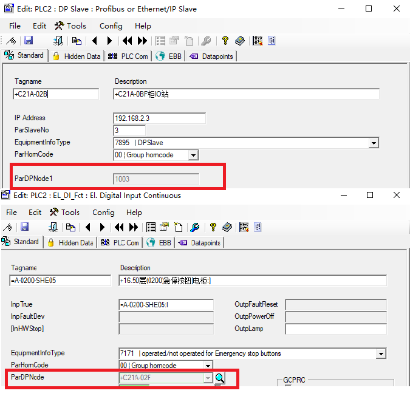

**页面底部功能区**

- 包含了每种对象的`Subtype`、`Process Fct`、`Building`、`Elevation`、`Panel`、`Diagram`、`Page`信息。

- 左边按钮区： `新建`按钮用于创建对象的导入文件；`清除`按钮用于清除导入文件类容；`另存为`按钮，用与把创建完成的对象导入文件，存放到其它地方(建议存放到项目文件下的'Import'子文件夹下)。

- 底部信息显示区：包含2部分，1.用于显示每个信息在数据库中存放的字段；2.用于显示创建对象时的进度。

###### 2.2.2.1.2 BML创建页面

BML创建页面主要包含2部分：1.BML清单信息，主要包含文件位置与创建对象所需的信息列；2：从BML文件数据表中读取到信息显示表格； 

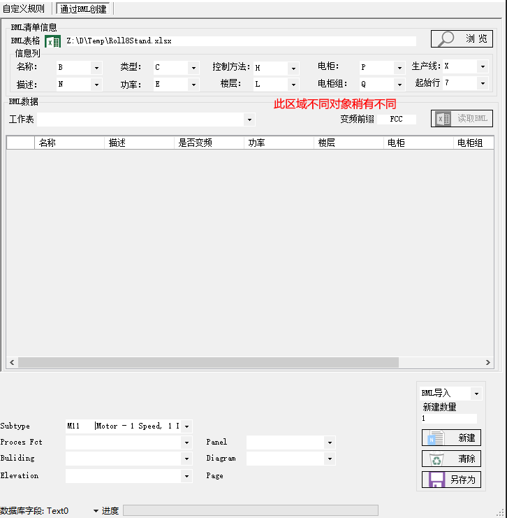
**BML清单信息**

- 第一次创建某对象时，需要浏览相应BML文件位置，完成后，系统会记住文件位置，并且存放在`配置文件`中。

- 信息列，一般保持默认值接口，对于部分有中英文的信息列(比如IO Remark与描述列），可以根据需要调整列的选择。
**BML数据**

- 在选择好BML表格文件后，需要再次选择，对应的工作薄，完成后，单机`读取BML`，按钮，读取信息到软件，不同的对象，读取不同的信息列。

- 比如电机，需要读取`名称`、`描述`、`功率`、`楼层`、`电柜`、`电柜组`以及`控制方式`。根据`控制方式`进一步判断是普通电机还是变频电机。
**创建对象**
- 通过BML方式新建对象，工程师无需选择`Subtype`、`Building`、`Elevation`、`Panel`等信息。

- 完成以上步骤后，可以单机`新建`按钮，创建对象导入文本文件。
  
##### 2.2.2.2 [EL_Motor]

通过点击[新建对象]页面`Elements`组`EL_Motor` 右边的按钮打开新建`EL_Motor`对象窗口。

###### 2.2.2.2.1 自定义规则与IO搜寻

打开[EL_Motor]窗口后，默认进入[自定义规则]界面，见下图: 

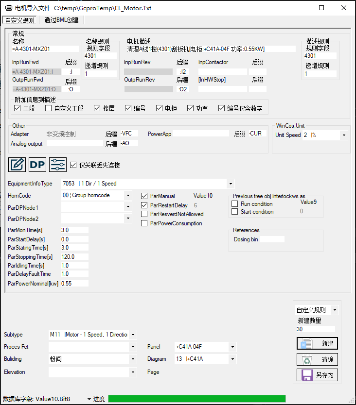
**界面介绍**

- 每次打开对象窗口后，名称与描述都会有一个默认值，比如电机默认名称为`=A-2001-MXZ01`,默认描述为`清理A线1楼(2001)出仓刮板机`。 
  
- 当不需要在描述中，添加相关额外信息到描述时，可以去掉`附件信息到描述`分组下的相关选择框，比如去掉工段信息后，描述将自动变为`1楼(2001)出仓刮板机`。

- `电柜`与`功率`信息如果需要附加到`描述`中，需要满足2个条件：1 勾选`电柜`与`功率`附加到`描述`选择框;2:选择电柜号，输入功率值。
  
- 当在界面底部`楼层` 选择框里面选择新的楼层信息后，`描述`中的楼层信息会自动改变。

- 电机的子对象 `InpRunFwd`、 `OutpRunFwd`、 `InpRunRev`、 `OutpRunFwd`、 `Adapter`、 `PowerApp`、 `Analog output`等对象名称统一按照`电机名称+后缀`规则来创建对象关系；后缀信息，存放在 `配置文件`中，如需更改，可以在界面上输入新值，再按下**回车键**，即可修改`配置文件`。

- 当电机为变频控制时，需要选择合适的单位，在`WinCos：Unit`分组里进行选择，默认为"%"。

- 当工程师选择不同的电机`SubType`时，`EquipmentInfoType`也会作相应的修改。

- 根据规则与IO搜寻方式创建对象时，需要工程师手动设定电机控制参数与电柜等信息，，且创建电机过程中，每个电机的参数值与电柜等附加信息保持不变，这也是对比BML创建方式的最大弊端。 

**创建示例**

- 创建制粉车间编号从`=A-4301-MXZ01`到`=A-4330-MXZ01` 30台清粉机，这些清粉机在同一个电柜"+C41A-04F"中，全部位于"粉间4楼"，图纸位于"+C41A"中，功率为0.55Kw，勾选 添加`电柜`与`功率`信息到描述，相关设置见本章节开始图片。
  
- 单击创建按钮后生成电机导入文本文件`EL_Motor`与关系文件`EL_Motor_Relation`.

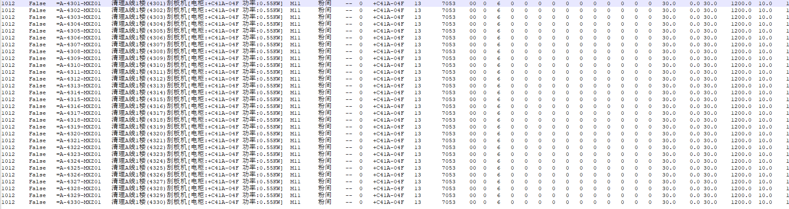

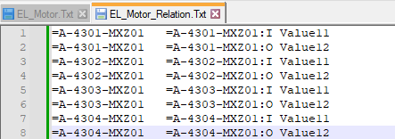

- 通过Gcpro菜单`Import\Import Table(IO or Objects)`选择电机的导入规则`IE_EL_Motor`，进行对象导入。

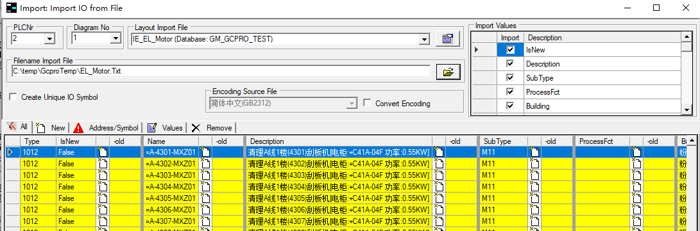

- 通过Gcpro菜单`Import\Import Relation)`导入对象关系

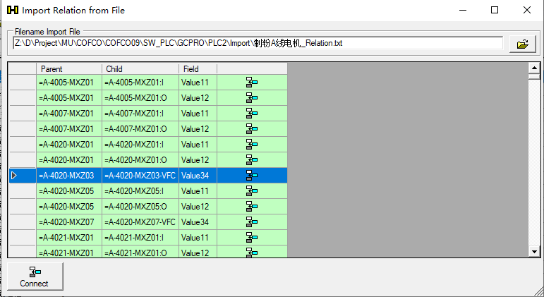
  
###### 2.2.2.2.2 通过BML创建

- 选择BML文件，确定好相关信息所在列，选择BML工作表，最后点击`读取BML`按钮，读取相关电机信息到表格中，同时在`新建数量`文本框中显示读取到的电机数量，见下图：

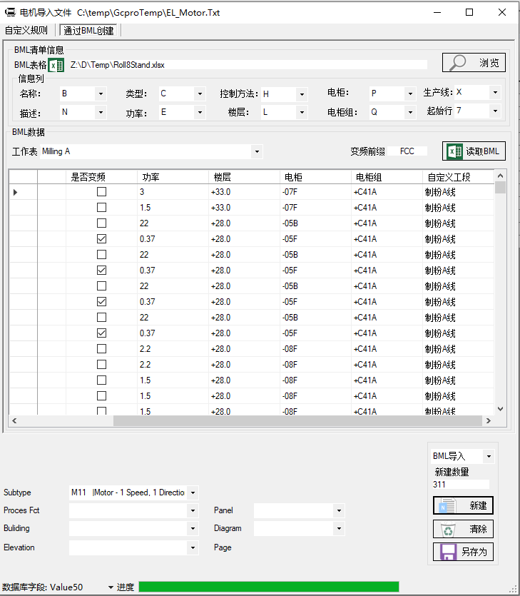

- 额外设置：工具会根据BML清单中信息结合`配置文件`中参数，自动判断电机控制类型，设定电机监控时间、启动时间、功率。针对特殊设备中的电机(高方筛，清粉机，组合筛等)，还会额外设置启动延时相关参数。
  
##### 2.2.2.3 [EL_Valve]

通过点击[新建对象]页面`Elements`组`EL_Valve` 右边的按钮打开新建`EL_Valve`对象窗口。

###### 2.2.2.3.1 自定义规则与IO搜寻

打开[EL_Valve]窗口后，默认进入[自定义规则]界面，见下图: 

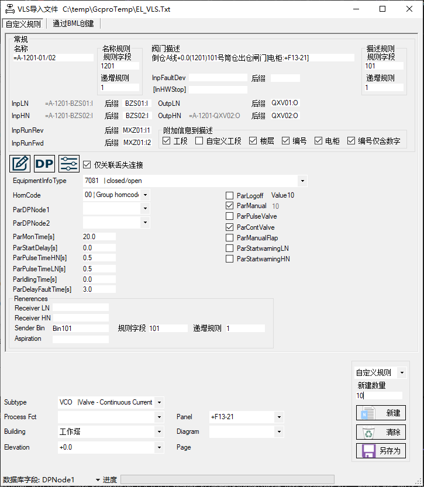
**界面介绍**

- 每次打开对象窗口后，名称与描述都会有一个默认值，比如闸门类VLS默认名称为`=A-1201-01/02`,默认描述为`倒仓A线1楼(1201)101号筒仓出仓闸门`。 
  
- 当不需要在描述中，添加相关额外信息到描述时，可以去掉`附件信息到描述`分组下的相关选择框，比如去掉工段信息后，描述将自动变为`1楼(1201)101号筒仓出仓闸门`。

- `电柜`信息如果需要附加到`描述`中，需要满足2个条件：1 勾选`电柜`附加到`描述`选择框;2:选择电柜号。
  
- 当在界面底部`楼层` 选择框里面选择新的楼层信息后，`描述`中的楼层信息会自动改变。

- 电机的子对象 `InpLN`、 `OutpLN`、 `InpHN`、 `OutpHN`、 `InpRunRev`、 `InpRunFwd`等对象名称统一按照`VLS前缀部分+后缀`规则来创建对象关系；后缀信息(BZS01等)，存放在 `配置文件`中，如需更改，可以在界面上输入新值，再按下**回车键**，即可修改`配置文件`。

- 当当工程师选择不同`SubType`后,工具将会自动调整`Equipment InfoType`与相关控制参数。

- 根据规则与IO搜寻方式创建对象时，需要工程师手动设定控制参数与电柜等附加信息，，且创建VLS过程中，每个VLS的参数值与电柜等附加信息保持不变。 

**创建示例**

- 创建工作塔编号从`=A-1201-01/02`到`=A-1230-01/02` 30台闸门，这些闸门在同一个电柜"+F3-21"中，全部位于"1楼"，图纸位于"+C11A"中勾选 添加`电柜`信息到描述，相关设置见本章节开始图片。

- 因为需要与发送仓关联，所以工程师 需要在`References\Sender Bin`文本处输入或者双击该位置，在弹出的窗口选择当前已经存在的仓。
  
- 单击创建按钮后生成VLS导入文本文件`EL_VLS`与关系文件`EL_VLS_Relation`.

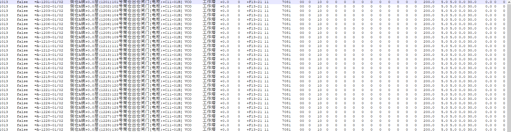

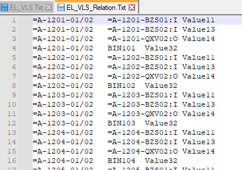

- 通过Gcpro菜单`Import\Import Table(IO or Objects)`选择电机的导入规则`IE_EL_VLS`，进行对象导入。

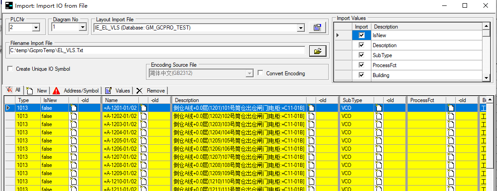

- 通过Gcpro菜单`Import\Import Relation)`导入对象关系

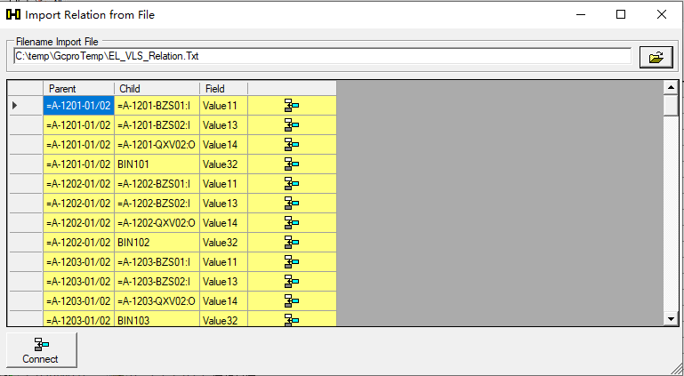

###### 2.2.2.3.2 通过BML创建

- 选择BML文件，确定好相关信息所在列，选择BML工作表，最后点击`读取BML`按钮，读取相关电机信息到表格中，同时在`新建数量`文本框中显示读取到的VLS数量，见下图：

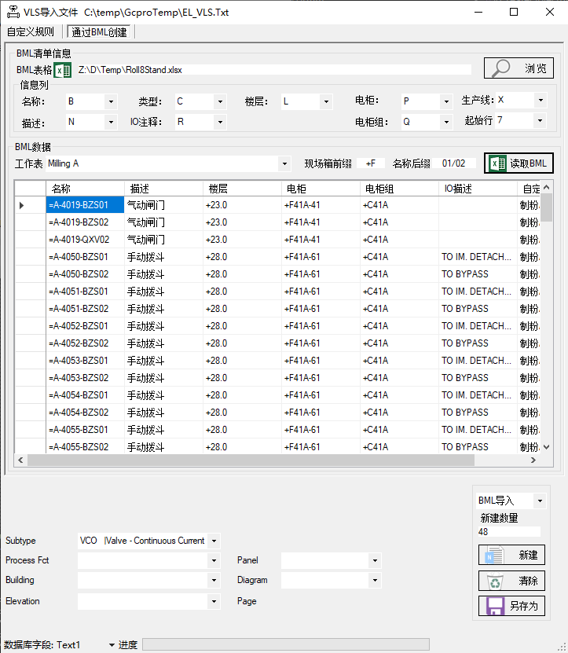

- 额外设置：工具会根据BML清单中信息，自动判断VLS控制类型；
- 对于双路阀，手动/自动拨斗，气动/手动闸门，除尘蝶阀等，如果在IO注释中(相关配置见`配置文件`章节)，有相应的去向描述，工具也会自动导出相关的连锁存储在关系文件中;

##### 2.2.2.4 [EL_AI]

通过点击[新建对象]页面`Elements`组`EL_AI` 右边的按钮打开新建`EL_AI`对象窗口。

###### 2.2.2.4.1 自定义规则与IO搜寻

打开[EL_AI]窗口后，默认进入[自定义规则]界面，见下图: 

**界面介绍**

- 每次打开对象窗口后，名称与描述都会有一个默认值，默认名称为`=A-4020-MXZ01AI`,默认描述为`制粉A线2楼(4020)磨粉机电流`。 
  
- 当不需要在描述中，添加相关额外信息到描述时，可以去掉`附件信息到描述`分组下的相关选择框，比如去掉工段信息后，描述将自动变为`2楼(4020)(4020)磨粉机电流`。

- `电柜`信息如果需要附加到`描述`中，需要满足2个条件：1 勾选`电柜`附加到`描述`选择框;2:选择电柜号。
  
- 当在界面底部`楼层` 选择框里面选择新的楼层信息后，`描述`中的楼层信息会自动改变。

- 电流的子对象 `InpAI`等对象名称统一按照`名称+后缀`规则来创建对象关系；后缀信息(:AI)，存放在 `配置文件`中，如需更改，可以在界面上输入新值，再按下**回车键**，即可修改`配置文件`。

- 当当工程师选择不同`SubType`后,工具将会自动调整`Equipment InfoType`与相关控制参数。

- 根据规则与IO搜寻方式创建对象时，需要工程师手动设定控制参数与电柜等附加信息，，且创建AI过程中，每个AI的参数值与电柜等附加信息保持不变。 

**创建示例**

- 创建工作塔编号从`=A-4020-MXZ01AI`到`=A-4050-MXZ01` 30个磨粉机主电机一侧电流，这些电流在同一个电柜"+41A-02F"中，全部位于"2楼"，图纸位于"+C41A"中勾选 添加`电柜`信息到描述，相关设置见本章节开始图片。
  
- 单击创建按钮后生成VLS导入文本文件`EL_AI`与关系文件`EL_AI_Relation`.

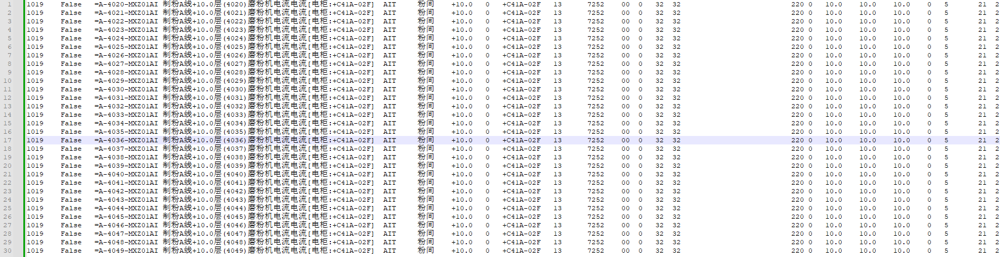

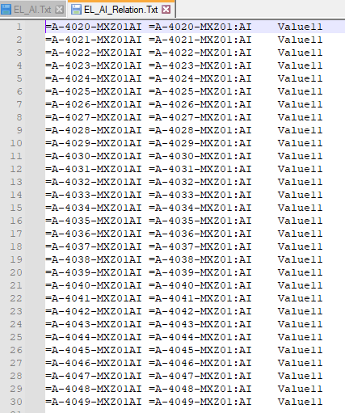

- 通过Gcpro菜单`Import\Import Table(IO or Objects)`选择电机的导入规则`IE_EL_AI`，进行对象导入。

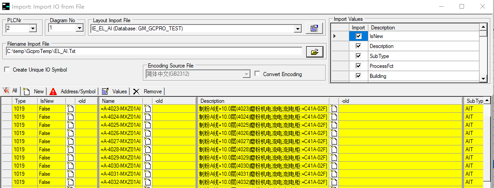

- 通过Gcpro菜单`Import\Import Relation)`导入对象关系

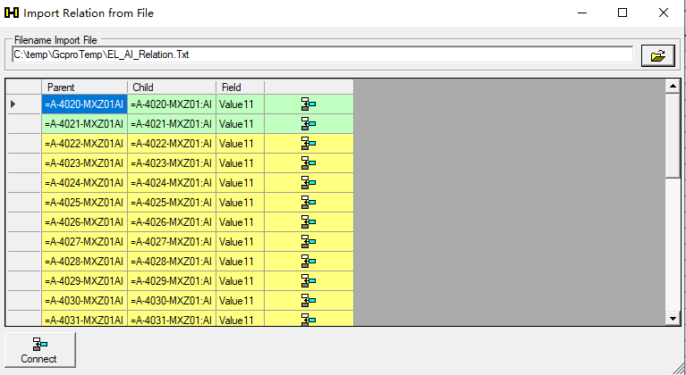

###### 2.2.2.4.2 通过BML创建

目前[通过BML创建]方式仅支持建立磨粉机电流；

- 选择BML文件，确定好相关信息所在列，选择BML工作表，最后点击`读取BML`按钮，读取相关电机信息到表格中，同时在`新建数量`文本框中显示读取到的磨粉机主电机数量，生产的对象名称为`磨粉机电机名称+AI后缀`(AI后缀见`配置文件`部分。见下图：

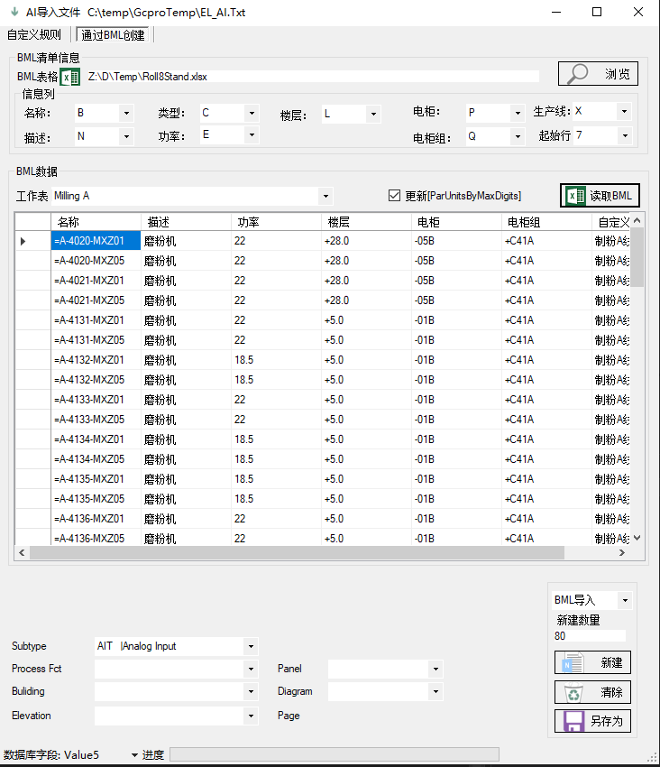

- 额外设置：工具会根据BML清单功率信息结合`配置文件`中参数，自动设置AI的高低限以及监控时间等参数，当勾选`更新ParUnitsByMaxDigits`功能后，工具还将设置模拟 量输入点和互感器设置相关的参数。

##### 2.2.2.5 [EL_DI]

通过点击[新建对象]页面`Elements`组`EL_DI` 右边的按钮打开新建`EL_DI`对象窗口。

###### 2.2.2.5.1 自定义规则与IO搜寻

打开[EL_DI]窗口后，默认进入[自定义规则]界面，见下图: 

**界面介绍**

- 每次打开对象窗口后，名称与描述都会有一个默认值，默认名称为`=A-4201-BLH01`,默认描述为`制粉A线6楼(4201)401号基粉仓高料位`。 
  
- 当不需要在描述中，添加相关额外信息到描述时，可以去掉`附件信息到描述`分组下的相关选择框，比如去掉工段信息后，描述将自动变为`6楼(4201)401号基粉仓高料位`。

- `电柜`信息如果需要附加到`描述`中，需要满足2个条件：1 勾选`电柜`附加到`描述`选择框;2:选择电柜号。
  
- 当在界面底部`楼层` 选择框里面选择新的楼层信息后，`描述`中的楼层信息会自动改变。

- 电流的子对象 `InpTrue`等对象名称统一按照`名称+后缀`规则来创建对象关系；后缀信息(:I)，存放在 `配置文件`中，如需更改，可以在界面上输入新值，再按下**回车键**，即可修改`配置文件`。

- 当当工程师选择不同`SubType`后,工具将会自动调整`Equipment InfoType`与相关控制参数。

- 根据规则与IO搜寻方式创建对象时，需要工程师手动设定控制参数与电柜等附加信息，，且创建DI过程中，每个DI的参数值与电柜等附加信息保持不变。 

**创建示例**

- 创建工作塔编号从`=A-4201-BLH01`到`=A-4231-BLH01` 30个基粉仓高料位，`描述规则`字段自动变为401，在创建对象过程中401会以此增加。这些电流在同一个电柜"+F41A-61"中， 全部位于"6楼"，图纸位于"+C41A"中勾选 添加`电柜`信息到描述，相关设置见本章节开始图片。
  
- 单击创建按钮后生成VLS导入文本文件`EL_DI`与关系文件`EL_DI_Relation`.

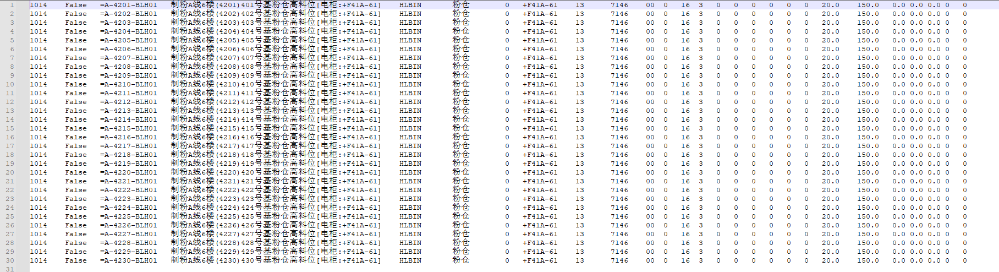

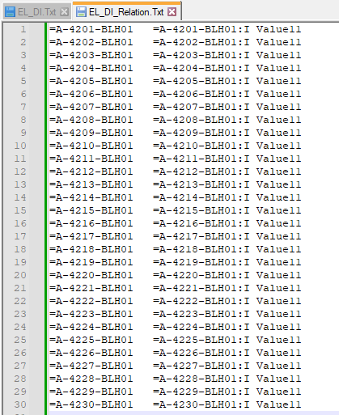

- 通过Gcpro菜单`Import\Import Table(IO or Objects)`选择电机的导入规则`IE_EL_DI`，进行对象导入。

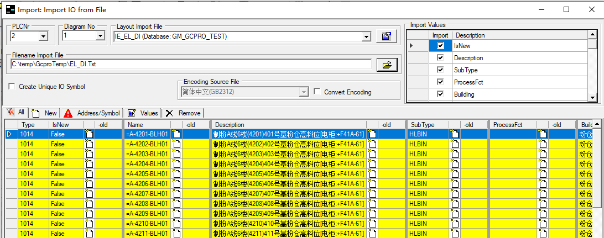

- 通过Gcpro菜单`Import\Import Relation)`导入对象关系

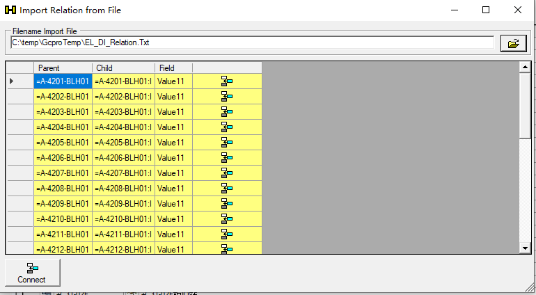

###### 2.2.2.5.2 通过BML创建

- 选择BML文件，确定好相关信息所在列，选择BML工作表，最后点击`读取BML`按钮，读取相关电机信息到表格中，同时在`新建数量`文本框中显示读取到的DI类型的设备数量，在创建对象时，描述名称会结合BML表中的描述列类容以及名称编码生成合适的描述见下图：

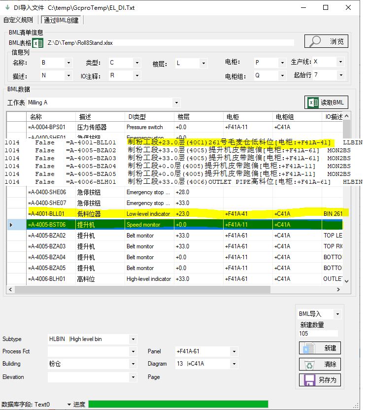

- `=A-4001-BLL01`与`=A-4005-BZA02`在BML表中的原始信息如下： 

| Number        | Type                | Floor | MachineCN | Cabinet No. | Section | IO Remark(EN) |
| :------------ | :------------------ | :---- | :-------- | :---------- | :------ | :------------ |
| =A-4001-BLH01 | Low-level indicator | +23.0 | 低料位器  | +F41A-41    | +C41A   | BIN 261       |
| =A-4005-BZA02 | Belt monitor        | +23.0 | 提升机    | +F41A-61    | +C41A   | 顶部左边      |

利用以上信息工具会根据`配置文件`中的配置形成如下描述： 
`制粉工段+23.0层(4001)261号毛麦仓低料位[电柜:+F41A-41]`,注意BIN261被解释成毛麦仓。 
`制粉工段+33.0层(4005)提升机皮带跑偏[电柜:+F41A-61]` 

##### 2.2.2.6 [EL_FBAL]暂无

通过点击[新建对象]页面`Elements`组`EL_FBAL` 右边的按钮打开新建`EL_FBAL`对象窗口。

###### 2.2.2.6.1 自定义规则与IO搜寻

打开[EL_FBAL]窗口后，默认进入[自定义规则]界面，见下图: 

###### 2.2.2.6.2 通过BML创建

##### 2.2.2.7 [EL_ScaleAdapter]暂无

通过点击[新建对象]页面`Elements`组`EL_ScaleAdapter` 右边的按钮打开新建`EL_ScaleAdapter`对象窗口。

###### 2.2.2.7.1 自定义规则与IO搜寻

打开[EL_ScaleAdapter]窗口后，默认进入[自定义规则]界面，见下图: 

###### 2.2.2.7.2 通过BML创建

##### 2.2.2.8 [VFCAdapter]

通过点击[新建对象]页面`Elements`组`VFCAdapter` 右边的按钮打开新建`VFCAdapter`对象窗口。

###### 2.2.2.8.1 自定义规则与IO搜寻

打开[VFCAdapter]窗口后，默认进入[自定义规则]界面，见下图: 

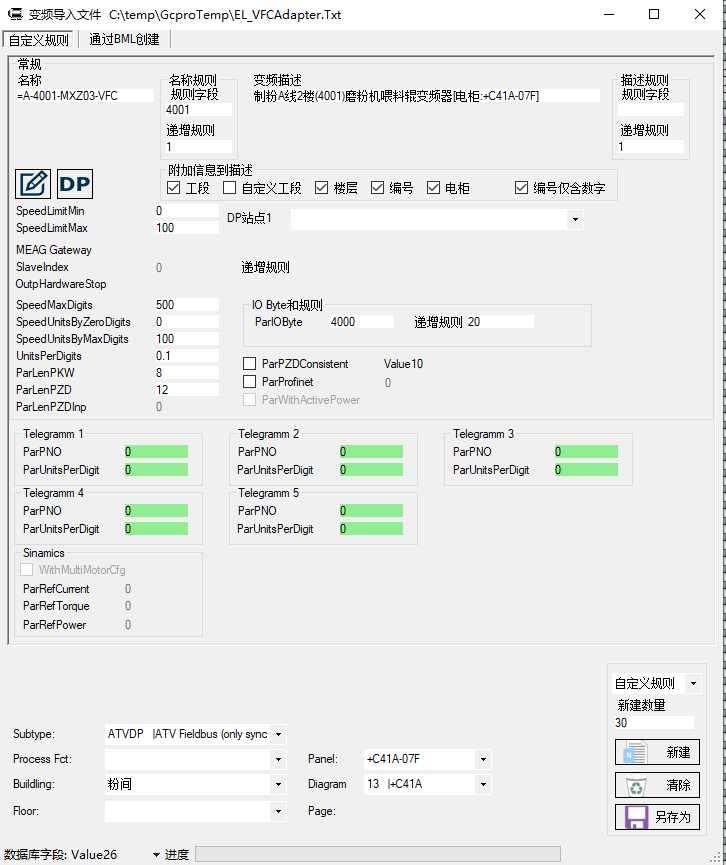

**界面介绍**

- 每次打开对象窗口后，名称与描述都会有一个默认值，默认名称为`=A-4001-MXZ03-VFC`,默认描述为`制粉A线2楼(4001)磨粉机喂料辊变频器`。 
  
- 当不需要在描述中，添加相关额外信息到描述时，可以去掉`附件信息到描述`分组下的相关选择框，比如去掉工段信息后，描述将自动变为`2楼(4001)磨粉机喂料辊变频器`。

- `电柜`信息如果需要附加到`描述`中，需要满足2个条件：1 勾选`电柜`附加到`描述`选择框;2:选择电柜号。
  
- 当在界面底部`楼层` 选择框里面选择新的楼层信息后，`描述`中的楼层信息会自动改变。

- 变频名称统一按照`名称+后缀`规则来创建,后缀信息(可以在电机界面中更改，默认为-VFC)存放在 `配置文件`中，如需更改，可以在[电机界面]中`Adapter`后缀文本中输入新值，再按下**回车键**，即可修改`配置文件`。

- 当当工程师选择不同`SubType`后,工具将会自动调整相关控制参数。

- 根据规则与IO搜寻方式创建对象时，需要工程师手动设定控制参数与电柜等附加信息，，且创建变频器过程中，每个变频器的参数值与电柜等附加信息保持不变。 

- 重点关注 `ParIOByte`的设置，`递增规则`会根据变频器自动调整，达到地址无间隙的目的。工程师也可以手动更改，以保证一定的规律性，但是必须大于等于变频器通信所需要的字节数。
**创建示例**

- 创建编号从`=A-4001-MXZ03-VFC`到`=A-4031-MXZ03-VFC` 30个磨粉机喂料棍变频器，`描述规则`字段自动变为空，这些电流在同一个电柜"+C41A-07F"中， 全部位于"2楼"，图纸位于"+C41A"中勾选 添加`电柜`信息到描述，相关设置见本章节开始图片。
  
- 单击创建按钮后工具**仅生成**VFCAdapter导入文本文件`EL_VFCAdapter`

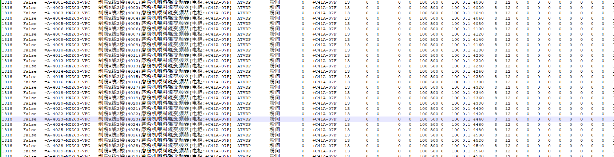

- 通过Gcpro菜单`Import\Import Table(IO or Objects)`选择电机的导入规则`IE_VFCAdapter`，进行对象导入。

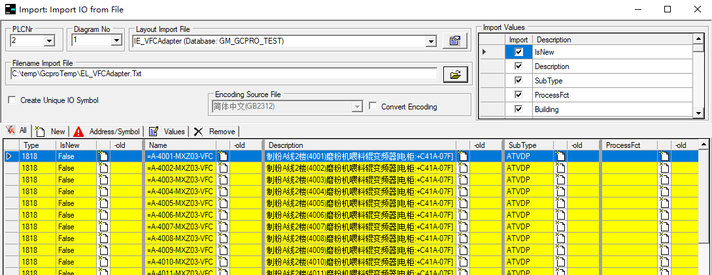

###### 2.2.2.8.2 通过BML创建

##### 2.2.2.9 [EL_RollStandPhoenix]

通过点击[新建对象]页面`Elements`组`EL_RollStandPhoenix` 右边的按钮打开新建`EL_RollStandPhoenix`对象窗口。

###### 2.2.2.9.1 自定义规则与IO搜寻

打开[EL_RollStandPhoenix]窗口后，默认进入[自定义规则]界面，见下图: 

**界面介绍**

- 每次打开对象窗口后，名称与描述都会有一个默认值，默认名称为`=A-4001-KCL30`,默认描述为`制粉A线2楼(4001)磨粉机现场控制箱`。 
  
- 当不需要在描述中，添加相关额外信息到描述时，可以去掉`附件信息到描述`分组下的相关选择框，比如去掉工段信息后，描述将自动变为`2楼(4001)磨粉机现场控制箱`。

- `电柜`信息如果需要附加到`描述`中，需要满足2个条件：1 勾选`电柜`附加到`描述`选择框;2:选择电柜号。
  
- 当在界面底部`楼层` 选择框里面选择新的楼层信息后，`描述`中的楼层信息会自动改变。

- 变频名称统一按照`名称+后缀`规则来创建对象，后缀信息(-KCL30)存放在务必按照`配置文件`中`GcObjectInfo\MA_Roll8Stand\MDDx`或者`GcObjectInfo\MA_Roll8Stand\LC_COM` 值来新建对象。如有需要可以更改以上配置。

- 当当工程师选择不同`SubType`后,工具将会自动调整相关控制参数。

- 重点关注 `ParIOByte`的设置，`递增规则`会根据变频器自动调整，达到地址无间隙的目的。工程师也可以手动更改，以保证一定的规律性，但是必须大于等于变频器通信所需要的字节数。
**创建示例**

- 创建编号从`=A-4001-KCL30`到`=A-4031-KCL30` 30个MDDYZ磨粉机控制器，`描述规则`字段自动变为空，这些控制板电源在同一个电柜"+C41A-03F"中， 全部位于"2楼"，图纸位于"+C41A"中勾选 添加`电柜`信息到描述，相关设置见本章节开始图片。
  
- 单击创建按钮后工具**仅生成**MDDYZ导入文本文件`EL_MDDYZ`

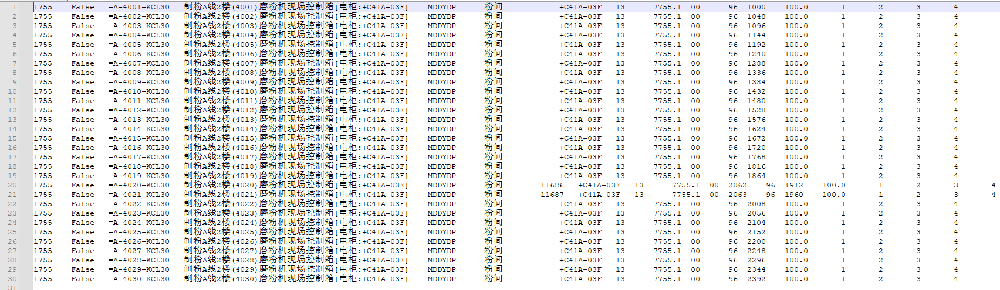

- 通过Gcpro菜单`Import\Import Table(IO or Objects)`选择电机的导入规则`IE_EL_MDDYZ`，进行对象导入。

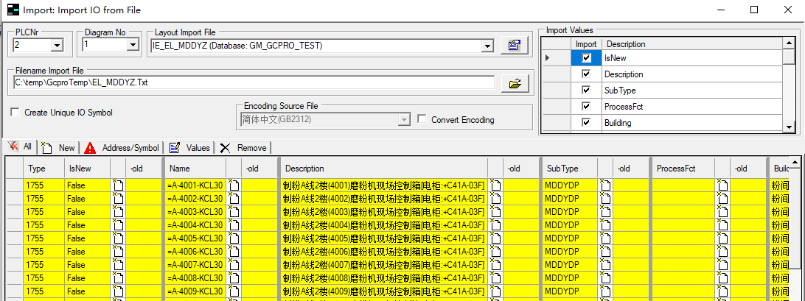

###### 2.2.2.9.2 通过BML创建

##### 2.2.2.10 [EL_MDDx_DP]

通过点击[新建对象]页面`Elements`组`EL_MDDx_DP` 右边的按钮打开新建`EL_MDDx_DP`对象窗口。

###### 2.2.2.10.1 自定义规则与IO搜寻

打开[EL_MDDx_DP]窗口后，默认进入[自定义规则]界面，见下图: 

**界面介绍**

- 每次打开对象窗口后，名称与描述都会有一个默认值，默认名称为`=A-4201-BLH01`,默认描述为`制粉A线6楼(4201)401号基粉仓高料位`。 
  
- 当不需要在描述中，添加相关额外信息到描述时，可以去掉`附件信息到描述`分组下的相关选择框，比如去掉工段信息后，描述将自动变为`6楼(4201)401号基粉仓高料位`。

- `电柜`信息如果需要附加到`描述`中，需要满足2个条件：1 勾选`电柜`附加到`描述`选择框;2:选择电柜号。
  
- 当在界面底部`楼层` 选择框里面选择新的楼层信息后，`描述`中的楼层信息会自动改变。

- 电流的子对象 `InpTrue`等对象名称统一按照`名称+后缀`规则来创建对象关系；后缀信息(:I)，存放在 `配置文件`中，如需更改，可以在界面上输入新值，再按下**回车键**，即可修改`配置文件`。

- 当当工程师选择不同`SubType`后,工具将会自动调整`Equipment InfoType`与相关控制参数。

- 根据规则与IO搜寻方式创建对象时，需要工程师手动设定控制参数与电柜等附加信息，，且创建DI过程中，每个DI的参数值与电柜等附加信息保持不变。 

**创建示例**

- 创建工作塔编号从`=A-4201-BLH01`到`=A-4231-BLH01` 30个基粉仓高料位，`描述规则`字段自动变为401，在创建对象过程中401会以此增加。这些电流在同一个电柜"+F41A-61"中， 全部位于"6楼"，图纸位于"+C41A"中勾选 添加`电柜`信息到描述，相关设置见本章节开始图片。
  
- 单击创建按钮后生成VLS导入文本文件`EL_DI`与关系文件`EL_DI_Relation`.

- 通过Gcpro菜单`Import\Import Table(IO or Objects)`选择电机的导入规则`IE_EL_AI`，进行对象导入。

- 通过Gcpro菜单`Import\Import Relation)`导入对象关系

- 切换到`EL_MDDX_DP`界面的[通过BML新建]界面，选择`AppDemo`文件里中`Roll8Stand.xlsx`文件，选择`Milling A`工作表。
- 点击`读取BML`按钮，工具，将在BML表格中寻找MDDx，并且将数量**38**自动输入到`新建数量`文本框中。完成以上步骤后，见下图：
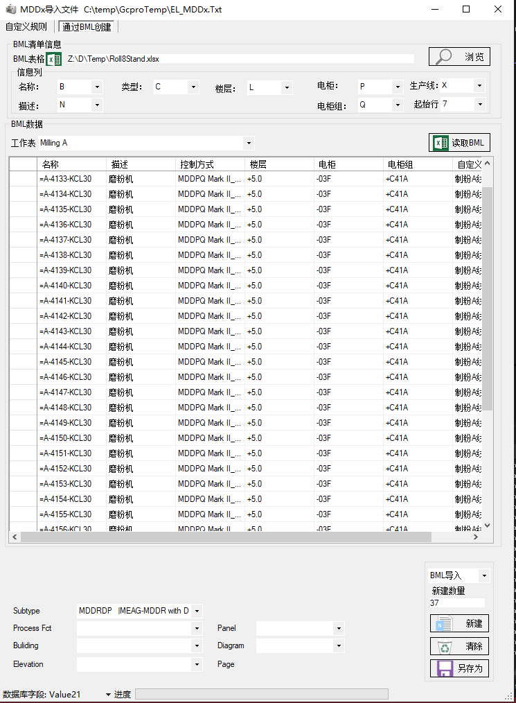
- 点击新建按钮，完成创建后，点击另存为按钮，将文件存入到`Import`文件中，对象命名为"**制粉A线MDDx.txt**"。
- `MDDYZPhoenix`磨粉机控制器对象建立过程和`MDDx_DP`类似，对象文件命名为"**制粉A线MDDYZPhoenix.txt**"。

###### 2.2.2.10.2 通过BML创建

##### 2.2.2.11 [MA_MotorWithBypass]

通过点击[新建对象]页面`Machines`组`MA_MotorWithBypass` 右边的按钮打开新建`MA_MotorWithBypass`对象窗口。

###### 2.2.2.11.1 自定义规则与IO搜寻

打开[MA_MotorWithBypass]窗口后，默认进入[自定义规则]界面，见下图: 

###### 2.2.2.11.2 通过BML创建

##### 2.2.2.12 [MA_Discharger]暂无

通过点击[新建对象]页面`Machines`组`MA_Discharger` 右边的按钮打开新建`MA_Discharger`对象窗口。

###### 2.2.2.12.1 自定义规则与IO搜寻

打开[MA_Discharger]窗口后，默认进入[自定义规则]界面，见下图: 

###### 2.2.2.12.2 通过BML创建

##### 2.2.2.13 [MA_MDDYZPhoenix]

通过点击[新建对象]页面`Machines`组`MA_MDDYZPhoenix` 右边的按钮打开新建`MA_MDDYZPhoenix`对象窗口。

###### 2.2.2.13.1 自定义规则与IO搜寻

打开[MA_MDDYZPhoenix]窗口后，默认进入[自定义规则]界面，见下图: 

###### 2.2.2.13.2 通过BML创建

##### 2.2.2.14 [MA_Roll8Stand]

通过点击[新建对象]页面`Machines`组`MA_Roll8Stand]` 右边的按钮打开新建`MA_Roll8Stand]`对象窗口。

###### 2.2.2.14.1 自定义规则与IO搜寻

打开[MA_Roll8Stand]窗口后，默认进入[自定义规则]界面，见下图: 

###### 2.2.2.14.2 通过BML创建

##### 2.2.2.15 [MA_Roll8Stand]

通过点击[新建对象]页面`OtherObjects`组`Storage/Bin]` 右边的按钮打开新建`Storage/Bin]`对象窗口。

###### 2.2.2.15.1 自定义规则与IO搜寻

打开[Storage/Bin]窗口后，默认进入[自定义规则]界面，见下图: 

###### 2.2.2.15.2 通过BML创建

##### 2.2.2.16 [DischargerVertex]暂无

通过点击[新建对象]页面`OtherObjects`组`DischargerVertex]` 右边的按钮打开新建`DischargerVertex]`对象窗口。

###### 2.2.2.16.1 自定义规则与IO搜寻

打开[DischargerVertex]窗口后，默认进入[自定义规则]界面，见下图: 

###### 2.2.2.16.2 通过BML创建

##### 2.2.2.17 [DP_Slave_Diag]

通过点击[新建对象]页面`OtherObjects`组`DP_Slave_Diag]` 右边的按钮打开新建`DP_Slave_Diag]`对象窗口。

###### 2.2.2.17.1 自定义规则与IO搜寻

打开[DP_Slave_Diag]窗口后，默认进入[自定义规则]界面，见下图: 

###### 2.2.2.17.2 通过BML创建

##### 2.2.2.18 [开发者选项]

通过点击[新建对象]页面`OtherObjects`组`DP_Slave_Diag]` 右边的按钮打开新建`DP_Slave_Diag]`对象窗口。

###### 2.2.2.18.1 规则设计

#### 2.2.3 [软件信息]

**当前版本**:

- 1.0.0.1

## 3 appsettings.json配置文件

## 4 应用示例

### 4.1 通过BML创建磨粉机

- 相关Demo文件存放与 `T:\Auto\_Automation\BCOM_PLC_RD\EfficiencyTool\BCOM_Tool\GcproExtensionApp\AppDemo` 文件夹中。
- `GM_GCPRO_TEST.MDB`,`GCS7R3LIB_Local`为项目相关数据库文件；
- `Roll8Stand.xlsx`为BML文件，其中包含粉间设备；
- `Import`文件夹包含了工具导出的建立磨粉机相关的文件；

#### 4.1.1 创建磨粉机步骤

- 总体来说，按照自地而上的顺序新建各种对象。
  
##### 4.1.1.1 建立磨粉机`MA_Roll8Stand`或者`MA_MDDYZPhoenix`需要的各种对象

- 1个磨粉机控制器的DP/PN站点诊断`DP_Slave`；
- 1个磨粉机控制器的EL`EL_MDDx_DP`或者`EL_RollStandPhoenix`；
- 2个磨粉机喂料棍变频器的DP/PN站点诊断`DP_Slave`；
- 2个磨粉机喂料辊变频器`EL_VFCAdapter`；
- 2个磨粉机喂料棍电机`EL_Motor`；
- 2到4个磨粉机磨辊电机`EL_Motor`；
- 2到4个磨粉机磨辊电机的电流`EL_AI`(**其中涉及到大量的EL_AI参数设置和模拟量输入点的参数设置**）；
- 1个磨粉机Machine层级对象`MA_Roll8Stand`或者`MA_MDDYZPhoenix`
  
##### 4.1.1.2 导入对象之间的关联关系

- 磨粉机控制器的EL与磨粉机控制器的DP/PN站点诊断的关联；
- 磨粉机喂料棍变频器与磨粉机喂料棍变频器的DP/PN站点诊断的关联；
- 磨粉机喂料辊电机与磨粉机喂料棍变频器的关联；
- 磨粉机喂料辊电机，磨辊电机，磨粉机控制器，磨辊电流与`MA_Roll8Stand`或者`MA_MDDYZPhoenix`的关联。
  
#### 4.2.1 通过BML创建磨粉机详细说明

##### 4.2.1.1 建立DP/PN通信站点诊断

##### 4.2.1.2 建立喂料辊变频器

- 从工具软件[主界面]-[新建对象]界面中打开新建`VFCAdapter`窗口。
- 在[自定义规则]界面中，设置好建立变频器通讯的`ParIOByte`地址，这里我们设定为 `2000`；
- 切换到`VFCAdapter`界面的[通过BML新建]界面，选择`AppDemo`文件里中`Roll8Stand.xlsx`文件，选择`Milling A`工作表，设置好`变频前缀`默认为"FCC", 
  `名称后缀`默认为"-VFC"(新建完成的变频器名称会以`电机名称+名称后缀`，比如`=A-4020-MXZ03-VFC`)。
- 点击`读取BML`按钮，工具，将在BML表格中寻找变频器，并且将数量**93**自动输入到`新建数量`文本框中。完成以上步骤后，见下图：

  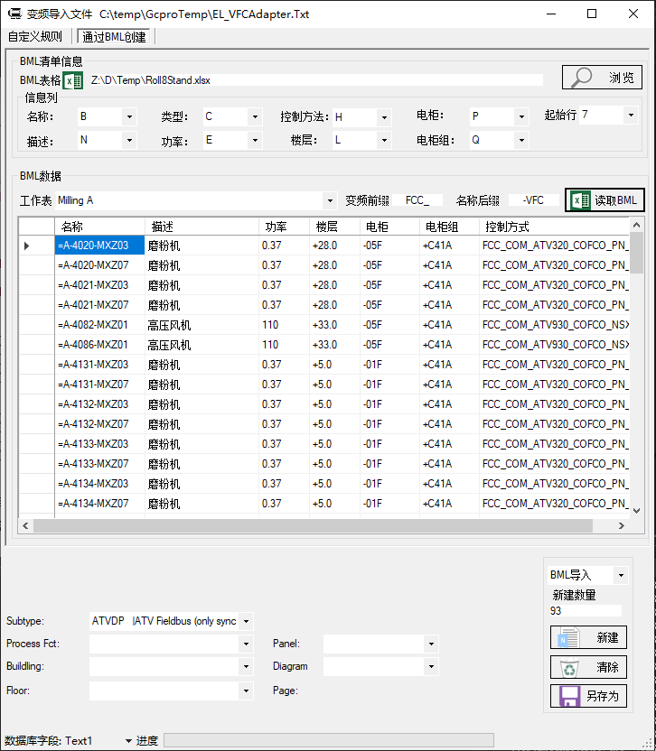
  
- 点击新建按钮，完成创建后，点击另存为按钮，将文件存入到`Import`文件中，对象文件命名为"**制粉A线变频器.txt**".

##### 4.2.1.3 建立磨粉机电机

- 从工具软件[主界面]-[新建对象]界面中打开新建`EL_Motor`窗口。
- 在[自定义规则]界面中，确定好要附加到描述的信息。
- 切换到`EL_Motor`界面的[通过BML新建]界面，选择`AppDemo`文件里中`Roll8Stand.xlsx`文件，选择`Milling A`工作表，设置好`变频前缀`默认为"FCC"。 
- 点击`读取BML`按钮，工具，将在BML表格中寻找变频器，并且将数量**311**自动输入到`新建数量`文本框中。完成以上步骤后，见下图：

- 点击新建按钮，完成创建后，点击另存为按钮，将文件存入到`Import`文件中，对象命名为"**制粉A线电机.txt**"，对象关系命名为"**制粉A线电机_Relation.txt**"。
  
##### 4.2.1.4 建立磨粉机磨辊电机电流

- 从工具软件[主界面]-[新建对象]界面中打开新建`EL_AI`窗口。
- 在[自定义规则]界面中，确定好要附加到描述的信息，设置好建立MDDx通讯的`ParIOByte`地址，这里我们设定为 `4000`；
- 切换到`EL_AI`界面的[通过BML新建]界面，选择`AppDemo`文件里中`Roll8Stand.xlsx`文件，选择`Milling A`工作表，根据需要选择`更新[ParUnitsByMaxDigits]`(注意，选择后，工具软件，将更新模拟量IO输入的相关参数，以适配电流互感器)。
- 点击`读取BML`按钮，工具，将在BML表格中寻找变频器，并且将数量**80**自动输入到`新建数量`文本框中。完成以上步骤后，见下图：

- 点击新建按钮，完成创建后，点击另存为按钮，将文件存入到`Import`文件中，对象命名为"**制粉A线磨粉机电流.txt**"，对象关系命名为"**制粉A线磨粉机电流_Relation.txt**"。

##### 4.2.1.5 建立磨粉机控制器

- 从工具软件[主界面]-[新建对象]界面中打开新建`EL_MDDx_DP`窗口。
- 在[自定义规则]界面中，确定好要附加到描述的信息。
- 切换到`EL_MDDX_DP`界面的[通过BML新建]界面，选择`AppDemo`文件里中`Roll8Stand.xlsx`文件，选择`Milling A`工作表。
- 点击`读取BML`按钮，工具，将在BML表格中寻找MDDx，并且将数量**38**自动输入到`新建数量`文本框中。完成以上步骤后，见下图：

- 点击新建按钮，完成创建后，点击另存为按钮，将文件存入到`Import`文件中，对象命名为"**制粉A线MDDx.txt**"。
- `MDDYZPhoenix`磨粉机控制器对象建立过程和`MDDx_DP`类似，对象文件命名为"**制粉A线MDDYZPhoenix.txt**"。

##### 4.2.1.6 建立磨粉机Machine`MA_Roll8Stand`或者`MA_MDDYZPhoenix`

- 从工具软件[主界面]-[新建对象]界面中打开新建`MA_Roll8Stand`窗口。
- 在[自定义规则]界面中，确定好要附加到描述的信息。
- 切换到`MA_Roll8Stand`界面的[通过BML新建]界面，选择`AppDemo`文件里中`Roll8Stand.xlsx`文件，选择`Milling A`工作表。
- 点击`读取BML`按钮，工具，将在BML表格中寻找磨粉机相关的设备，并且将磨粉机数量**38**自动输入到`新建数量`文本框中，完成以上步骤后，见下图：
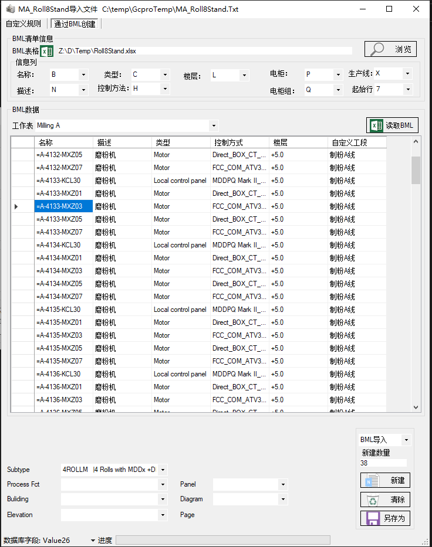
- 点击新建按钮，完成创建后，点击另存为按钮，将文件存入到`Import`文件中，对象命名为"**制粉A线MA_MDDx磨粉机.txt**"，对象关系命名为"**制粉A线MA_MDDx磨粉机_Relation.txt**"。
- `MA_MDDYZPhoenix`磨粉机控制器对象建立过程和MDDx类似，对象文件命名为"**制粉A线MA_MDDYZPhoenix磨粉机.txt**"，对象关系命名为"**制粉A线MA_MDDYZPhoenix磨粉机_Relation.txt**"。

##### 4.2.1.7 GCPRO中依次导入对象与对象关系文件

- 按照变频器-电机-电流-磨机控制器-磨粉机Machine 顺序依次导入对象到GCPRO中，先选择相应的导入规则，再选择导入文件，然后导入。见导入变频器示例图片。
  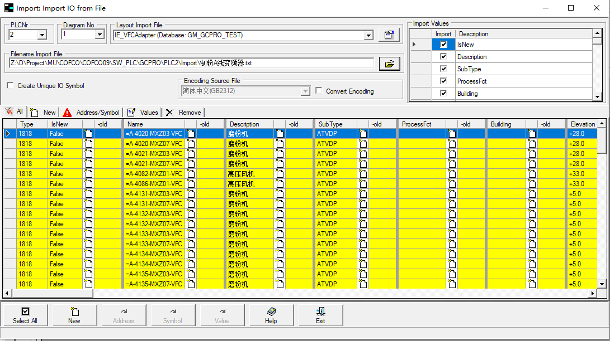

- 按照电机-电流-磨粉机Machine 顺序以此导入关联关系文件，关联完成后，底色会变成绿色，见下图：

  
  